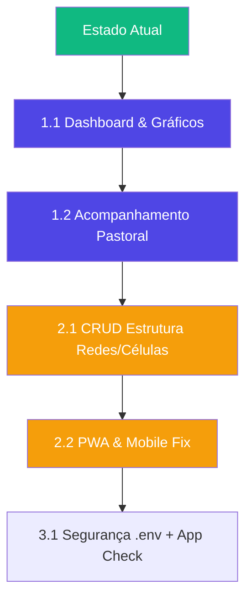

# 🚀 Roadmap de Produção — Nexo-Hub

Estado atual do projeto e tudo que precisa ser feito para que o SaaS esteja **pronto para produção** de forma completa e profissional.

---

## 📊 Estado Atual (Março/Abril 2026)

### O que já funciona:
| Módulo | Status | Notas |
|---|---|---|
| Login / Auth | ✅ Completo | E-mail/senha, esqueceu senha, fluxo de convite |
| Gestão de Usuários | ✅ Completo | CRUD, IDs sequenciais, filtros, paginação |
| RBAC (4 papéis) | ✅ Completo | Membro, Líder, Discipulador, Root |
| **Relatórios** | ✅ Completo | Envio semanal, fotos, lista de presença, exportação |
| **Firestore Rules** | ✅ Funcionais | Segurança por role e proteção de documentos |
| UI/UX Premium | ✅ Completo | Dark theme, glassmorphism, animações |
| Hosting | ✅ Ativo | Firebase Hosting (cellhub-henrique-dev.web.app) |
| Dashboard KPIs | ⚠️ Parcial | Médias básicas na lista de relatórios, sem gráficos |
| Eventos/Agenda | ❌ Não existe | Menu presente mas sem funcionalidade |
| Mobile | ⚠️ Parcial | Funcional mas exige polimento de responsividade |

---

## 🎯 Fase 1: Inteligência & Pastoral (Prioridade Máxima)

Agora que os dados estão sendo coletados (Relatórios), precisamos transformá-los em **ação**.

### 1.1 📊 Dashboard & Gráficos (KPIs)
- **Visualização**: Implementar `recharts` para gráficos de linha (tendência de presença) e barras (comparativo de visitantes).
- **Ranking**: Top células com maior engajamento e constância de envio.
- **Filtros Temporais**: Analisar dados por mês, trimestre ou período customizado.

### 1.2 🛡️ Acompanhamento Pastoral (Prevenção de Evasão)
- **Histórico Individual**: No perfil do membro, exibir % de presença nas últimas 12 semanas.
- **Alertas de Risco**: Listar membros com < 50% de presença no último mês para ação do líder.
- **Notificações**: Alerta no Dashboard para líderes que ainda não enviaram o relatório da semana até segunda-feira.

---

## 🎯 Fase 2: Gestão de Estrutura & Expansão

### 2.1 🏗️ Módulo de Redes e Células (CRUD)
- Gerenciar a árvore hierárquica (criar redes, vincular células, transferir membros entre células).
- Configuração de detalhes da célula (dia da semana, endereço, horário).

### 2.2 📱 Responsividade & PWA
- Ajustar tabelas e formulários para telas pequenas (cards em mobile).
- Configurar `manifest.json` e Service Workers para instalação como App (PWA).

### 2.3 🗓️ Agenda Ministerial
- Calendário de eventos da igreja (cultos, retiros, treinamentos).
- Confirmação de presença em eventos (RSVP).

---

## 🎯 Fase 3: Profissionalização (Infra & Segurança)

### 3.1 🔒 Hardenização & DevOps
- [ ] Migrar Firebase Config para `.env` (`VITE_API_URL`, etc).
- [ ] Configurar Firebase App Check para proteção contra bots.
- [ ] Implementar logs de auditoria no backend (quem alterou qual usuário).
- [ ] Separar ambientes de `staging` e `production` no Firebase.

### 3.2 🌐 Branding & Domínio
- [ ] Registro de domínio `nexo-hub.com.br`.
- [ ] Customização de e-mails de sistema (SendGrid ou Firebase Extension).

---

## ⚡ Ordem de Execução Recomendada

> [!TIP]
> O próximo grande passo é o **Dashboard de Gráficos**. Ver os dados subindo e descendo visualmente ajuda os pastores a entenderem a saúde da igreja num relance.
