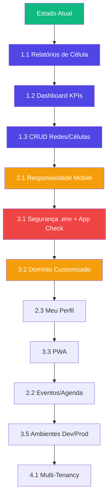

# 🚀 Roadmap de Produção — Nexo-Hub

Estado atual do projeto e tudo que precisa ser feito para que o SaaS esteja **pronto para produção** de forma completa e profissional.

---

## 📊 Estado Atual (Março 2026)

### O que já funciona:
| Módulo | Status | Notas |
|---|---|---|
| Login / Auth | ✅ Completo | E-mail/senha, esqueceu senha, fluxo de convite |
| Gestão de Usuários | ✅ Completo | CRUD, IDs sequenciais, filtros, paginação |
| RBAC (4 papéis) | ✅ Completo | Membro, Líder, Discipulador, Root |
| Firestore Rules | ✅ Funcionais | Segurança básica por role |
| UI/UX Premium | ✅ Completo | Dark theme, glassmorphism, animações |
| Hosting | ✅ Ativo | Firebase Hosting (cellhub-henrique-dev.web.app) |
| Relatórios | ❌ Não existe | Menu presente mas sem funcionalidade |
| Eventos/Agenda | ❌ Não existe | Menu presente mas sem funcionalidade |
| Dashboard KPIs | ❌ Não existe | Sem métricas visuais |
| Mobile | ⚠️ Parcial | Interface não é responsiva |

---

## 🎯 Fase 1: Funcionalidades Core (Prioridade Máxima)

Esses módulos são **essenciais** para que a plataforma tenha valor real para os usuários.

### 1.1 📋 Módulo de Relatórios de Célula
> _O coração da operação — sem isso, o sistema é apenas um cadastro._

**O que fazer:**
- Formulário de relatório semanal (preenchido pelo Líder)
  - Data do encontro
  - Quantidade de presentes
  - Lista de presença (checkbox dos membros da célula)
  - Observações / oração
  - Oferta arrecadada (opcional)
- Histórico de relatórios por célula
- Visão consolidada para Discipulador (métricas por rede)
- Exportação em PDF (relatório mensal)

**Coleção Firestore:**
```
reports/{reportId} → {
  cellId, cellName, networkId, leaderId,
  date, presentCount, absentCount,
  members: [{ uid, name, present: bool }],
  notes, offering, createdAt
}
```

### 1.2 📊 Dashboard com KPIs
> _Transformar dados em decisões — é isso que vende um SaaS._

**Métricas sugeridas:**
- Total de membros ativos / inativos
- Taxa de presença média por célula (últimas 4 semanas)
- Crescimento da rede (novos membros por mês)
- Células sem relatório na semana atual (alerta)
- Ranking de células por engajamento

**Stack sugerida:** [Recharts](https://recharts.org/) ou [Chart.js](https://www.chartjs.org/) — leves e sem dependências pesadas.

### 1.3 🏗️ Gestão de Redes e Células (CRUD de Estrutura)
> _Hoje a estrutura só existe via SeedDevTool. Precisa de um painel real._

**O que fazer:**
- CRUD de Redes (criar rede, nomear, atribuir discipulador)
- CRUD de Células (criar célula, vincular à rede, atribuir líder, endereço, dia da semana)
- Transferir membro entre células
- Inativar/reativar célula

---

## 🎯 Fase 2: Experiência & Polimento

### 2.1 📱 Responsividade Mobile
> _Líderes preenchem relatórios no celular. Se não funciona no mobile, não funciona._

- Sidebar colapsada por padrão em telas < 768px
- Tabelas com scroll horizontal ou layout em cards
- Formulários single-column em mobile
- Touch-friendly (botões maiores, espaçamento adequado)

### 2.2 🗓️ Módulo de Eventos/Agenda
- Criação de eventos (cultos especiais, retiros, conferências)
- Calendário visual
- Confirmação de presença (RSVP)
- Notificação de lembrete (se PWA/push)

### 2.3 👤 Página "Meu Perfil"
- Visualizar e editar dados pessoais
- Alterar senha
- Foto de perfil (Firebase Storage)
- Histórico de atividades

---

## 🎯 Fase 3: Preparação para Produção Real

### 3.1 🔒 Segurança

> [!CAUTION]
> **As chaves do Firebase estão hardcoded no código-fonte.** Isso é aceitável para desenvolvimento (chaves públicas do Firebase são projetadas para serem expostas no client), mas boas práticas pedem:

- [ ] Mover config para `.env` e usar `import.meta.env.VITE_*`
- [ ] Adicionar `.env` ao `.gitignore`
- [ ] Configurar App Check (anti-abuse) no Firebase Console
- [ ] Refinar Firestore Rules para produção (mais granulares por campo)
- [ ] Remover SeedDevTool do build de produção (`process.env.NODE_ENV`)

### 3.2 🌐 Domínio & Branding
- [ ] Registrar domínio customizado (ex: `nexo-hub.com.br`)
- [ ] Configurar domínio no Firebase Hosting
- [ ] Adicionar favicon e meta tags (Open Graph para compartilhamento)
- [ ] Meta description e título por página (SEO)

### 3.3 📲 PWA (Progressive Web App)
> _Permitir instalação no celular sem precisar de app store._

- [ ] Adicionar `manifest.json` (nome, ícone, cores)
- [ ] Service Worker para cache offline
- [ ] Splash screen
- [ ] Funcionar offline com dados em cache (leitura)

### 3.4 🔔 Notificações
- [ ] Firebase Cloud Messaging (FCM)
- [ ] Push: "Relatório pendente esta semana"
- [ ] Push: "Novo membro adicionado à sua célula"
- [ ] Push: "Evento próximo"

### 3.5 🏭 Ambientes Separados
- [ ] Criar projeto Firebase `cellhub-prod`
- [ ] `.firebaserc` com aliases: `dev` e `prod`
- [ ] Deploy de produção separado: `firebase use prod && npm run deploy`
- [ ] Banco de dados isolado (dados de teste nunca vão para prod)

---

## 🎯 Fase 4: Escala & Monetização

### 4.1 Multi-Tenancy (Multi-Igreja)
> _Para se tornar um SaaS real, cada igreja/organização precisa ter seus dados isolados._

- Cada "tenant" (igreja) tem seu namespace no Firestore
- Painel super-admin para gerenciar tenants
- Planos: Free (1 rede), Pro (ilimitado), Enterprise

### 4.2 💳 Pagamento & Assinatura
- Integrar Stripe ou MercadoPago
- Planos mensais com limites por features
- Página de billing e faturas

### 4.3 📈 Analytics & Monitoramento
- Firebase Analytics (comportamento do usuário)
- Firebase Crashlytics (erros em produção)
- Sentry (error tracking detalhado)
- Logs de auditoria (quem fez o quê, quando)

---

## ⚡ Ordem de Execução Recomendada



> [!IMPORTANT]
> **Recomendação imediata:** Comece pelo **Módulo de Relatórios** — é o que dá utilidade real ao sistema e será o primeiro ponto de contato diário dos líderes com a plataforma.

---

## 📋 Quick Wins (Coisas rápidas de alto impacto)

Essas são melhorias pequenas que podem ser feitas a qualquer momento:

- [ ] Mudar `name` no `package.json` de "sistema-de-agenda" para "nexo-hub"
- [ ] Adicionar `<title>Nexo-Hub</title>` dinâmico por página
- [ ] Adicionar loading skeleton nas tabelas (ao invés de texto "Carregando...")
- [ ] Toast notifications ao invés de alertas de sucesso/erro inline
- [ ] Confirmação antes de sair de formulário com dados não salvos
- [ ] Ordenação clicável nas colunas da tabela de usuários
- [ ] Exportar lista de usuários em CSV
